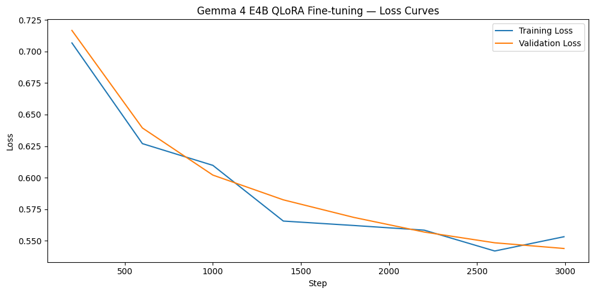
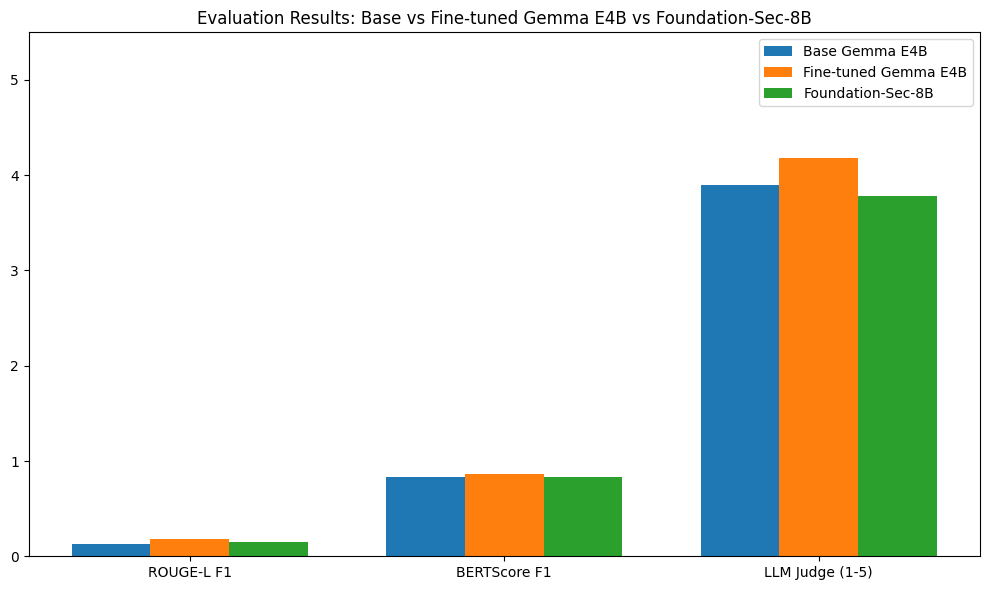

# Cybersecurity LLM Fine-tuning

Fine-tuning Gemma 4 E4B on cybersecurity instruction-response pairs using QLoRA. The fine-tuned model outperforms Foundation-Sec-8B, a purpose-built cybersecurity model at twice the parameter count, across all evaluation metrics.

## Results

| Metric | Base Gemma E4B | Fine-tuned Gemma E4B | Foundation-Sec-8B |
|---|---|---|---|
| ROUGE-L F1 | 0.1284 | 0.1857 (+44.6%) | 0.1481 |
| BERTScore F1 | 0.8284 | 0.8628 (+4.2%) | 0.8341 |
| LLM Judge (1-5) | 3.900 | 4.180 (+7.2%) | 3.780 |




## Setup

### Requirements
- Google Colab with A100 GPU (recommended)
- HuggingFace account with access to Gemma 4
- OpenAI API key for LLM judge evaluation

### Installation
All dependencies are installed in Cell 1 of the notebook:
```bash
pip install transformers bitsandbytes accelerate trl peft
pip install rouge-score bert-score datasets openai
```

### HuggingFace Access
Gemma 4 requires accepting the model license on HuggingFace before use.
1. Visit https://huggingface.co/google/gemma-4-E4B-it
2. Accept the license agreement
3. Add your HuggingFace token to Colab secrets as `HF_TOKEN`

### OpenAI API Key
Add your OpenAI API key to Colab secrets as `OPENAI_API_KEY` for the LLM judge evaluation cell.

## Usage

Open `gemma_finetuning.ipynb` in Google Colab and run cells in order.

| Cell | Description |
|---|---|
| 1 | Install dependencies |
| 2 | Imports and HuggingFace login |
| 3 | Load and split dataset |
| 4 | Tokenizer and format function |
| 5 | Token length analysis |
| 6 | Load model for QLoRA training |
| 7 | LoRA config |
| 8 | Training config and run |
| 9 | Base model inference |
| 10 | Fine-tuned model inference |
| 11 | ROUGE-L and BERTScore metrics |
| 12 | LLM-as-a-judge evaluation |
| 13 | Foundation-Sec-8B inference |
| 14 | Full results comparison |

### Resuming from checkpoint
If the session disconnects during training, resume from the latest checkpoint:
```python
trainer.train(resume_from_checkpoint="/content/drive/MyDrive/cybersec-finetuned/checkpoint-XXXX")
```

## Dataset

[Trendyol Cybersecurity Instruction Tuning Dataset](https://huggingface.co/datasets/Trendyol/Trendyol-Cybersecurity-Instruction-Tuning-Dataset) — ~53,000 instruction-response pairs covering vulnerability analysis, incident response, threat modeling, malware behavior, and penetration testing.

| Split | Size |
|---|---|
| Train | ~47,700 |
| Validation | ~2,660 |
| Test | ~2,660 |

## Model and Training

| Parameter | Value |
|---|---|
| Base model | google/gemma-4-E4B-it |
| Quantization | 4-bit NF4 with double quantization |
| LoRA rank | 16 |
| LoRA alpha | 32 |
| LoRA dropout | 0.05 |
| Target modules | all-linear |
| Learning rate | 2e-4 |
| Batch size | 4 |
| Gradient accumulation | 4 (effective batch size 16) |
| Max sequence length | 1536 |
| Epochs | 1 |
| Total steps | 2,993 |
| GPU | NVIDIA A100 40GB |
| Training time | ~6 hours |

## Evaluation

Three complementary metrics are used:

- **ROUGE-L F1** — lexical overlap between model outputs and reference answers
- **BERTScore F1** — semantic similarity using RoBERTa-large embeddings
- **LLM Judge** — GPT-4o-mini rates each response 1-5 for technical accuracy and completeness, following the [MT-Bench](https://arxiv.org/abs/2306.05685) methodology

Evaluation runs on 50 held-out test samples with greedy decoding and a maximum of 128 new tokens.

## Baselines

- **Base Gemma E4B** — untuned google/gemma-4-E4B-it with no fine-tuning
- **Foundation-Sec-8B** — [fdtn-ai/Foundation-Sec-8B](https://huggingface.co/fdtn-ai/Foundation-Sec-8B), Fortinet's purpose-built cybersecurity LLM based on Llama 3
